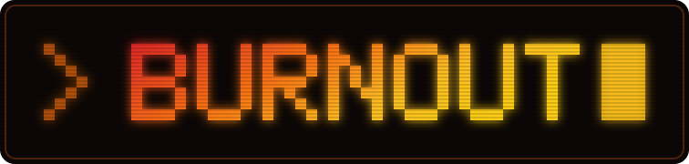
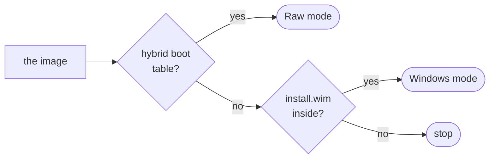

<div align="center">



### Writes a bootable USB drive from the command line

_Two commands. The same two on Windows, on macOS, and on Linux._


[](LICENSE)


<p align="center">
  <a href="#overview"><b>Overview</b></a> |
  <a href="#the-two-modes"><b>Modes</b></a> |
  <a href="#how-burnout-chooses"><b>Detection</b></a> |
  <a href="#the-layout-that-windows-mode-writes"><b>Layout</b></a> |
  <a href="#the-shape-of-the-command"><b>Commands</b></a> |
  <a href="docs/milestones.md"><b>Milestones</b></a>
</p>

</div>

---

> [!NOTE]
> **Nothing is built yet.** This repository holds the rules, the licence and the
> plan, and no code. The toolchain is Rust. There is no release, so there is
> nothing to install.
> [docs/milestones.md](docs/milestones.md) holds every decision, the reason
> behind it, and the options that lost.

---

## Overview

**Burnout** writes a disk image to a drive.
You give it an image and a drive, and it makes that drive start.

Most tools of this kind solve one half of the problem.
A byte copy writes a Linux ISO and fails on Windows.
Rufus builds a real Windows installer and runs on Windows only.
So the answer today depends on which image you hold and which computer you sit
at, and each answer has its own flags to learn.

Burnout removes the choice.
It reads the image, works out what that image needs, and does it.
The commands you type on a Mac are the commands you type on Windows, and the
image decides the rest.

<table>
<tr>
<td width="50%" valign="top">

### What it aims to do

- **Write any bootable image.** A Linux ISO, a BSD ISO, a raw `.img`.
- **Build a real Windows installer**, and not a copy of the files.
- **Hold a large install image**, with no split and no lost `install.esd`.
- **Skip the Windows 11 checks** for the TPM, Secure Boot and the RAM.
- **Skip the Microsoft account step** in Windows Setup.
- **Verify the write**, and name the check that it ran.

</td>
<td width="50%" valign="top">

### How it aims to behave

- The same commands on all three operating systems.
- No flag for a thing that the tool can work out by itself.
- It never mounts a drive, and it calls no tool of the host.
- It refuses the disk that your system starts from.
- It asks for a password through `sudo`, and never reads one itself.
- It names the target, and you confirm it, one time.

</td>
</tr>
</table>

---

## The two modes

A drive gets one of two treatments.
They share the device handling and the safety checks, and they share nothing
else.

| | **Raw mode** | **Windows mode** |
| :-- | :-- | :-- |
| **For** | Linux, BSD, any hybrid ISO, any `.img` | A Windows installer ISO |
| **What it does** | Copies the image byte for byte | Partitions, formats, writes files |
| **Partition table** | Comes from inside the image | Burnout creates it |
| **Verifies by** | One hash of the device against the source | One hash for each file |
| **Proves** | The drive holds the image | Each file arrived whole |

A Linux ISO is already a bootable disk image.
It carries its own boot code, its own partition table and its own EFI system
partition inside the file, so writing it means a copy of the bytes.

A Windows ISO is not a bootable disk image.
It holds no boot code for a USB drive, so a byte copy gives a drive that most
firmware refuses.
That one difference is why Windows mode exists, and why a tool like Rufus
exists at all.

---

## How Burnout chooses

You do not tell it. It reads the first 512 bytes.



A boot signature and a partition table in those 512 bytes mean a hybrid image,
so Burnout copies the bytes.
Without them, it looks inside for `sources/install.wim` or
`sources/install.esd` and builds the installer.
If it finds neither, it stops and says what it found.

`--mode raw|windows` overrides the result.
It exists for the day the guess is wrong, and a normal person never types it.

> [!NOTE]
> **Burnout runs on macOS. It does not make macOS install media.**
> Apple ships no ISO, and the supported path is `createinstallmedia`, which
> exists on macOS only. Burnout detects an `.app` bundle, an
> `InstallAssistant.pkg` or a compressed dmg and refuses with a sentence that
> names the right tool, rather than writing a drive that starts nothing. This
> is a non-goal and not a thing to come later.
> [The milestones](docs/milestones.md) say why.

---

## The layout that Windows mode writes

```
        +=================================================================+
        |  MBR partition table                                            |
        +===============================+=================================+
        |  Partition 1                  |  Partition 2                    |
        |  FAT32, about 1 GB            |  exFAT, the rest of the drive   |
        |                               |                                 |
        |  every boot file              |  sources/install.wim            |
        |  bootmgr, efi/, boot.wim      |  or sources/install.esd         |
        |  autounattend.xml             |  whole, and never split         |
        +===============================+=================================+
                    ^                                  ^
                    |                                  |
          UEFI firmware reads this.           Windows PE reads this,
          It reads FAT only, so every         after it has started from
          boot file lives here.               partition 1.
```

Three decisions hold this together, and [the milestones](docs/milestones.md)
record the reason for each.

- **exFAT, and not NTFS.** macOS mounts NTFS read only, so an NTFS partition
  would give a Windows path that works on two hosts out of three.
- **No file is ever split.** exFAT has no 4 GiB limit, so the install image
  goes on whole. Burnout writes no WIM file, which is also why it stays MIT and
  needs no wimlib.
- **MBR, and not GPT.** Burnout writes the table itself, so the spare EFI
  partition that `diskutil` adds on macOS never appears. It also leaves the
  door open for Legacy BIOS boot later.

---

## The shape of the command

> [!IMPORTANT]
> None of this runs yet. This is the interface the plan commits to, and it is
> here so that it can be argued with before it is built.

A device path cannot be the same on three operating systems.
`/dev/disk4`, `/dev/sdb` and `\\.\PhysicalDrive2` have nothing in common.
So a device path is never the target.

```bash
burnout list
```

```
  #  DRIVE                         SIZE      BUS     REMOVABLE
  1  Samsung SSD 980 PRO           1.0 TB    NVMe    no   (system disk)
  2  SanDisk Ultra                 32.0 GB   USB     yes
  3  Generic MassStorage           7.4 GB    USB     yes
```

```bash
burnout write ubuntu-24.04.iso 2
burnout write Win11_24H2.iso 2 --skip-hardware-checks --local-account
```

Those commands are identical on all three hosts.
`list` runs with no privilege, so you see your drives before you give a
password.

<details>
<summary><b>What happens inside a Windows write</b></summary>

```
burnout write Win11_24H2.iso 2
  -> reads the first 512 bytes, finds no hybrid table
  -> finds sources/install.wim, and selects Windows mode
  -> checks the privilege, and starts itself again through sudo if it must
  -> names the target drive, and waits for you to confirm it
  -> unmounts every volume on the drive
  -> writes an MBR with two partitions
  -> formats partition 1 as FAT32, and partition 2 as exFAT
  -> copies every boot file to partition 1
  -> copies the install image to partition 2, whole
  -> writes autounattend.xml for the options that you asked for
  -> reads each file back, and compares its hash
  -> flushes, and reports what it verified
```

Burnout calls no tool of the host at any step above.
It writes the partition table and both file systems itself, which is the only
reason the steps are identical on three operating systems.

</details>

---

## Safety

> [!WARNING]
> **Burnout erases the drive that you give it.**
> The erased data goes nowhere, and no undo exists. A wrong target, a drive
> that fails during the write, and a cable that comes loose all give the same
> result, and none of them is recoverable. Keep a backup of anything you value.
> Read [TERMS.md](TERMS.md) section 4 before you run it.

What the code must never do, from
[CONTRIBUTING.md](CONTRIBUTING.md):

- Write to a device that the person did not select and confirm.
- Write to the disk that the running system starts from.
- Treat a fixed disk as a removable one.
- Report a verification pass that it did not run.
- Hide the target behind a default. The person names the target every time.

**You supply the operating system.**
Burnout downloads no operating system, hosts none, and gives you a licence for
none.
A Windows installation needs a licence from Microsoft.

---

## Project documents

| Document | What it holds |
| :-- | :-- |
| [docs/milestones.md](docs/milestones.md) | Every decision, the reason for it, and the options that lost |
| [CONTRIBUTING.md](CONTRIBUTING.md) | How to take part, and the rule that no test opens a real device |
| [AGENTS.md](AGENTS.md) | The rules for anybody who changes this repository, human or agent |
| [SECURITY.md](SECURITY.md) | The threat model, and how to report a vulnerability privately |
| [TERMS.md](TERMS.md) | What the tool does to your data, and what you agree to |
| [SUPPORT.md](SUPPORT.md) | Where to ask a question |
| [CODE_OF_CONDUCT.md](CODE_OF_CONDUCT.md) | Applies to everybody who takes part |

---

## Two things to prove before any real code

Nobody has run either of these.
They carry the whole Windows path, and an afternoon answers both.

1. **Windows PE reads exFAT.** It has held exFAT support since Windows 10, and
   that is a claim from documentation and not a measurement.
2. **Setup finds the install image across the partition boundary.** Test it
   with the `InstallFrom` path in `autounattend.xml`, and without it.

If exFAT fails there, the layout above changes, and a WIM splitter written in
Rust comes back.

---

## Licence

MIT. See [LICENSE](LICENSE) and [TERMS.md](TERMS.md).

<div align="center">
<sub>Burnout erases drives. Read the warning above before you run it.</sub>
</div>
