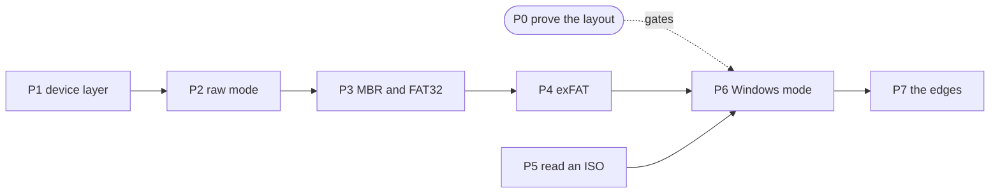

  <a href="../README.md"><b>Burnout</b></a>

# The roadmap to version 1

[docs/milestones.md](milestones.md) says what Burnout does and why.
This file says in what order to build it.

Each phase has a goal, the work in it, and an exit test.
Do not start a phase until the phase it depends on passes its exit test.
The sizes are relative: S is a day or two, M is a week, L is longer, and XL is
the one that needs a plan of its own.

P0 and P1 are done. `burnout list` runs on all three hosts.
Nothing writes a drive yet, so nothing can erase one yet.

---

## The order, and the reason for it

Two rules set the order.

**Risk first.**
The layout that Windows mode writes rests on two claims that nobody has
tested.
If they are wrong, the layout changes, and any Windows code written before
then is wasted.
So the test comes before the code, and it needs no code.

**Useful early.**
Raw mode is one code path, it exercises the whole device layer on three hosts,
and it writes a Linux drive.
That is a tool somebody can use, and it arrives long before Windows mode.
Ship it.

P0 and P5 do not wait for anything.
Start P0 now, because it can send P3 and P4 back to the drawing board.

| | Phase | Size | Release |
| --- | --- | --- | --- |
| P0 | Prove the layout | S | **done** |
| P1 | The skeleton and the device layer | L | **done** |
| P2 | Raw mode | M | **v0.1** |
| P3 | The partition table and FAT32 | M | |
| P4 | The exFAT writer | XL | **v0.2** |
| P5 | Reading an ISO | L | |
| P6 | Windows mode | L | **v0.3** |
| P7 | The edges | M | **v1.0** |

---

## P0. Prove the layout

**Size S. Done. [The result is here](spike-layout.md).**

Both questions are answered. Windows PE reads exFAT, and Setup does **not**
find the image across the partition boundary, so `autounattend.xml` with an
`InstallFrom` path is required on every Windows drive.

Build the two-partition drive by hand, with whatever tools your machine has.
This is an experiment and not a product, so `diskutil`, `mkfs` and `dd` are
all allowed here.
They are not allowed in the code.

The work:

1. Make an MBR drive with a FAT32 partition of about 1 GB and an exFAT
   partition for the rest.
2. Copy every file of a Windows 11 ISO to partition 1, except
   `sources/install.wim`.
3. Copy `sources/install.wim` to partition 2, keeping the `sources` directory.
4. Start it on real firmware in UEFI mode.
5. Repeat with an `autounattend.xml` that names the image in
   `<ImageInstall><OSImage><InstallFrom>`, and again without it.

**The exit test.** Two questions have written answers in
`docs/spike-layout.md`:

- Does Windows PE read exFAT?
- Does Setup find the install image on the second partition, with the
  `InstallFrom` path and without it?

**If exFAT fails**, the fallback is FAT32 on both partitions and a WIM splitter
written in Rust.
That keeps the MIT licence, it does not solve an oversized `install.esd`, and
it adds a phase the size of P4.
Better to learn it in an afternoon than in month three.

---

## P1. The skeleton and the device layer

**Size L. Done.**

`burnout list` names every drive on Windows, on macOS and on Linux, gives the
size to the byte, and marks the drive that the running system starts from. It
needs no privilege. `burnout-core` carries no dependency at all.

The five operations that the operating system owns, and nothing above them.

The work:

- A Cargo workspace. `burnout-core` holds everything that is not
  host-specific, and takes any target that reads, writes and seeks, so a test
  gives it a file. `burnout` is the command line on top.
- The device layer, in two traits and one handle. `DriveList` lists the
  drives and needs no drive and no handle. `DriveAccess` unmounts the volumes
  of one drive and opens it. The open handle reads, writes, seeks and flushes.
  Close is the drop of the handle.
  One trait cannot hold all five, because `flush` belongs to an open handle
  and `list` belongs to the host. One trait would make the write path of P2
  take the host as well as the target, and
  [CONTRIBUTING.md](../CONTRIBUTING.md) says the write path takes a source, a
  target handle and a progress callback, and nothing else.
- Linux: read `/sys/block` for the size, the model, the vendor and the
  removable flag. Unmount through the `umount2` system call.
  `umount` is a program, and this file says below that a tool of the host is
  not allowed. `umount2` is the peer of `DADiskUnmount` and
  `FSCTL_DISMOUNT_VOLUME`: three calls, and no subprocess. It also returns an
  error number rather than a sentence in the language of the host.
- macOS: IOKit for the list, Disk Arbitration for the unmount. Write to
  `/dev/rdiskN` and never `/dev/diskN`, because the raw node skips the buffer
  cache and is about ten times faster.
- Windows: SetupAPI for the list, `IOCTL_STORAGE_QUERY_PROPERTY` for the
  details, `FSCTL_LOCK_VOLUME` and `FSCTL_DISMOUNT_VOLUME` before the write.
- Find the disk the running system starts from, on each host, and mark it.
- Handle a logical sector size of 4096 as well as 512. A raw device refuses a
  write that its sector size does not divide.
- `burnout list`, with a stable index.
- GitHub Actions on Windows, macOS and Ubuntu, from the first commit.

An operating system API is not a tool of the host.
IOKit, Disk Arbitration and SetupAPI are how you open a device, so they are
fine.
`diskutil`, `mkfs` and `format` do the work that Burnout must do itself, so
they are not.

**The exit test.** `burnout list` names every drive correctly on all three
hosts, gives the size to the byte, and marks the system disk. It runs with no
privilege. CI is green on all three.

---

## P2. Raw mode

**Size M. Depends on P1. Ships as v0.1.**

The first thing a person can use.

The work:

- Read the image, write it to the device, in aligned blocks.
- Progress that reports what the code proves, and completion only after the
  flush returns. A byte count that reached the size of the source is not a
  finished write, because the operating system still holds a cache.
- Verify: read the device back and compare a hash against the source.
- The confirmation prompt, and the refusals: no system disk ever, no fixed
  disk unless forced, and no target that the person did not name.
- `--force` for a fixed disk. The person types the model and the size of the
  drive back, and not a letter and not the word yes. A prompt that takes one
  keystroke is one that people learn to answer without reading.
- Elevation. Restart through `sudo`, with the `BURNOUT_ELEVATED` guard against
  an endless loop. On Windows, print how to fix it and stop.
- `--no-elevate`, and no elevation attempt when the input is not a terminal.

**The exit test.** A drive written on each of the three hosts starts Ubuntu on
real hardware. The hash of the device matches the hash of the ISO. Every test
in the suite runs against a file, and none opens a device.

---

## P3. The partition table and FAT32

**Size M. Depends on P2.**

The first half of the Windows layout.

The work:

- Write an MBR: the boot signature, one entry per partition, the right type
  bytes, and CHS fields that are wrong in the way every tool writes them wrong.
- Format a FAT32 volume with the `fatfs` crate, which is MIT and works over
  anything that seeks, so it works over a file in a test and over a device in
  the product.
- Write a directory tree into it.

**The exit test.** A drive partitioned and filled by Burnout mounts on
Windows, on macOS and on Linux, and every file reads back with the hash it
went in with. The same code, run against an image file, passes in CI.

---

## P4. The exFAT writer

**Size XL. Depends on P3. Ships as v0.2.**

The one piece with no crate behind it, and the reason macOS can take part at
all.

Microsoft published the exFAT specification in 2019, so this is documented
work and not archaeology.
That public specification is also the reason exFAT beat NTFS and APFS for
partition 2.

The work:

- The boot sector and its backup, with the checksum sector.
- The FAT.
- The allocation bitmap.
- The upcase table.
- Directory entries: the file entry, the stream extension, and the name
  entries, with the name hash and the checksum over the whole entry set.
- Large files, which is the entire point, so a file over 4 GiB is the first
  test and not the last.

**The exit test.** A volume that Burnout formats mounts on Windows, on macOS
and on Linux. A 6 GiB file written into it reads back with the same hash on
all three. The host's own check tool reports no error.

---

## P5. Reading an ISO

**Size L. Depends on nothing. Start it beside P3.**

Burnout has to read the image itself, for the same reason it writes the
filesystem itself: a mount through the host is three different behaviours.

**This phase is larger than the milestones document assumed.**
A Windows ISO is UDF, not ISO 9660.
ISO 9660 stores an extent length in 32 bits, so it cannot hold a file of 4 GiB
or more, and a current `install.wim` is exactly that.
[The spike](spike-layout.md) measured both.
So reading a Windows ISO needs a UDF reader, and Burnout writes one.

The work:

- ISO 9660, with Joliet and Rock Ridge, for a Linux ISO.
- **UDF, read only**: the anchor descriptor, the logical volume and partition
  descriptors, the file set, file entries, directory descriptors, and plain
  extents. No compression, no encryption, no write path. This is decided, and
  the reason is below.
- Detect the mode from the first 512 bytes and from what is inside.
- Refuse a macOS installer by name, and say `createinstallmedia`.

**The exit test.** Burnout lists the contents of a Windows 11 ISO and a Ubuntu
ISO, and extracts `install.wim` from the first with the hash that the host's
own mount gives for the same file.

---

## P6. Windows mode

**Size L. Depends on P0, P4 and P5. Ships as v0.3.**

Put the four pieces together.

The work:

- Plan the layout, then write it: MBR, FAT32 of about 1 GB, exFAT for the rest.
- Copy every boot file to partition 1 and the install image to partition 2.
- Generate `autounattend.xml`: the `LabConfig` keys for the hardware checks,
  a local account for the Microsoft account step, and the `InstallFrom` path
  if P0 says it is needed. Write only the entries that the person asks for,
  and leave the rest of Setup interactive.
- Per-file verification, and a report that names the check it ran. A hash of
  the whole device proves nothing here, because Burnout built a filesystem
  that the source never had.

**The exit test.** A drive made on each of the three hosts installs Windows 11
on a machine with no TPM, with no Microsoft account step, from an ISO whose
`install.wim` is over 4 GiB.

---

## P7. The edges, and version 1

**Size M. Depends on P6. Ships as v1.0.**

The work that turns a program that works into one somebody else can use.

- One error message for every refusal, in Simplified Technical English, that
  names the fix.
- `--json` for the list and for progress, so a script can read it.
- Resume nothing and promise nothing about a stopped write. Say that the drive
  is now unusable, because it is.
- **Build provenance on every release artifact**, through
  `actions/attest-build-provenance`, plus a SHA256 for each one. No code
  signing certificate.
- The macOS and Windows download warning, and the way past it, in the README.
- `install.esd` alongside `install.wim` everywhere.
- The README stops saying that nothing is built.

**The exit test.** Somebody who has never seen the project writes a Windows
drive and a Linux drive, on a host you did not choose, without asking you a
question.

---

## The decisions that were open

All three are settled. The reasons are here so that a later reader can reopen
one with an argument rather than a preference.

### A fixed disk can be a target, and it costs two steps

Every drive in a desktop computer reports as fixed, so a refusal by that test
alone stops somebody writing an internal disk on purpose.
An easy yes stops nobody writing the wrong one by accident.

So `--force` allows a fixed disk, **and the person types the model and the
size of the drive back before the write starts**.
Not a letter, and not the word yes.
A prompt that takes one keystroke is a prompt that people learn to answer
without reading.

**The system disk is refused under every flag.** There is no escape for it,
and that is what [SECURITY.md](../SECURITY.md) already promises.

### Burnout reads UDF itself

A Windows ISO keeps `install.wim` in UDF, because ISO 9660 holds an extent
length in 32 bits and cannot address a file of 4 GiB or more.
[The spike](spike-layout.md) measured both facts.

Burnout gets a read-only UDF reader, scoped to what a Windows ISO uses: the
anchor descriptor, the logical volume and partition descriptors, the file set,
file entries, directory descriptors, and plain extents.
No compression, no encryption, and no write path.

Three reasons. It keeps the rule that Burnout never delegates to the host, so
one ISO reads the same way on three operating systems. ECMA-167 and the UDF
specification are public, so this is documented work. And it runs against a
file, so every test of it obeys the rule that no test opens a device.

Read the licence and the coverage of any crate before counting on it, but do
not plan around one.

**The fallback stays on the shelf:** take an extracted folder instead of an
ISO. It is honest and nearly free, and it makes the tool worse at the one
thing it exists to do.

### Version 1 buys no certificate

A code signing certificate matters for a binary that somebody **downloads**,
not one that a package manager installs.

- macOS applies Gatekeeper to a file that carries `com.apple.quarantine`,
  which a browser sets. Homebrew fetches with curl and does not set it.
  `cargo install` compiles on the machine, so there is nothing to quarantine.
- Windows SmartScreen keys off the Mark of the Web, which a browser sets.
- Linux never expected it. A distribution signs with its own key.

Apple silicon does need every binary to carry a signature, and an ad hoc one
counts. The Rust linker applies that already.

So the path that a certificate would help is one person downloading a built
binary from a release page in a browser. That is real, and it is not worth
several hundred a year for a project with no users yet.

**Instead, every release carries build provenance.**
`actions/attest-build-provenance` signs each artifact through Sigstore, and
anybody can check it with `gh attestation verify`.
A certificate proves that somebody paid a fee.
An attestation proves that this binary came from this commit through this
workflow, which is the stronger claim for a tool that asks for root.
Publish a SHA256 for each artifact as well, and document the warning and the
way past it for anybody who downloads one directly.

---

## What version 1 is not

Legacy BIOS boot, Windows To Go, a drive that holds many images, a write to a
single partition, a graphical interface, and macOS install media.
[The milestones](milestones.md) say why for each one.
